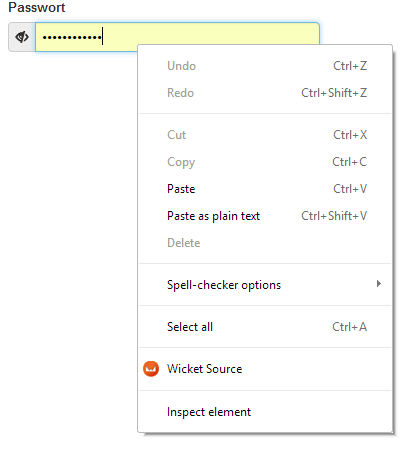

# wicketsource-contextmenu

This Chrome extension is an alternative to the default
[WicketSource Chrome Extension](https://github.com/42Lines/wicket-source/tree/master/WicketSourceForChrome).

It provides a context menu to quickly open components in your IDE. If an element is selected which isn't a Wicket element
then the component hierarchy will be searched for a Wicket element.

## Installation

Follow the instructions from [WicketSource](https://github.com/42Lines/wicket-source/wiki) but don't install
their Chrome plugin.

In Chrome go to *Settings* -> *Extensions* -> *Developer mode* -> *Load unpacked extension...* and point it to
this extension. The extension will use *http://localhost:9123* and no password to connect to your IDE plugin.
This isn't configurable.
